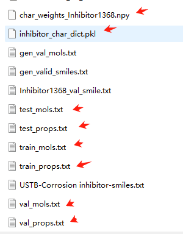
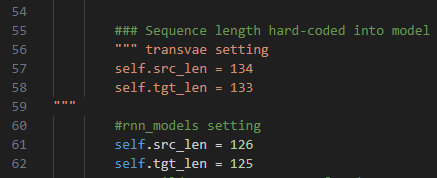
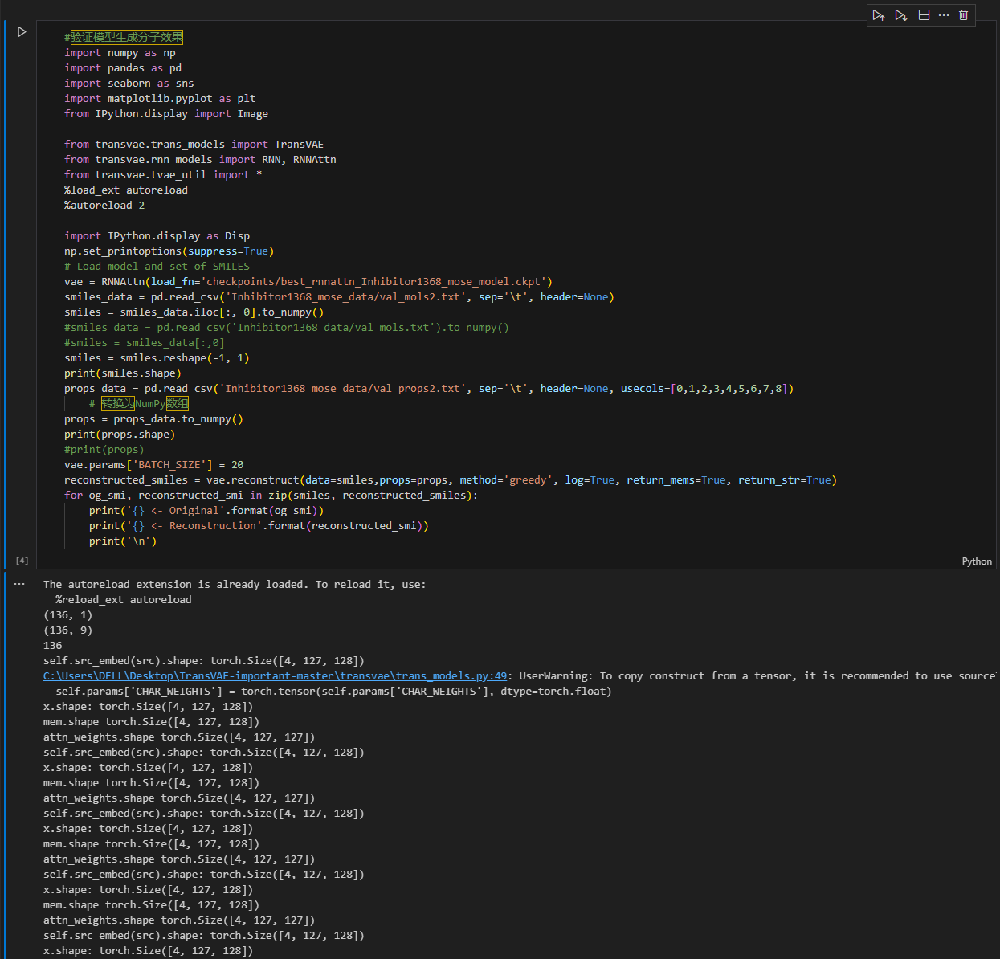
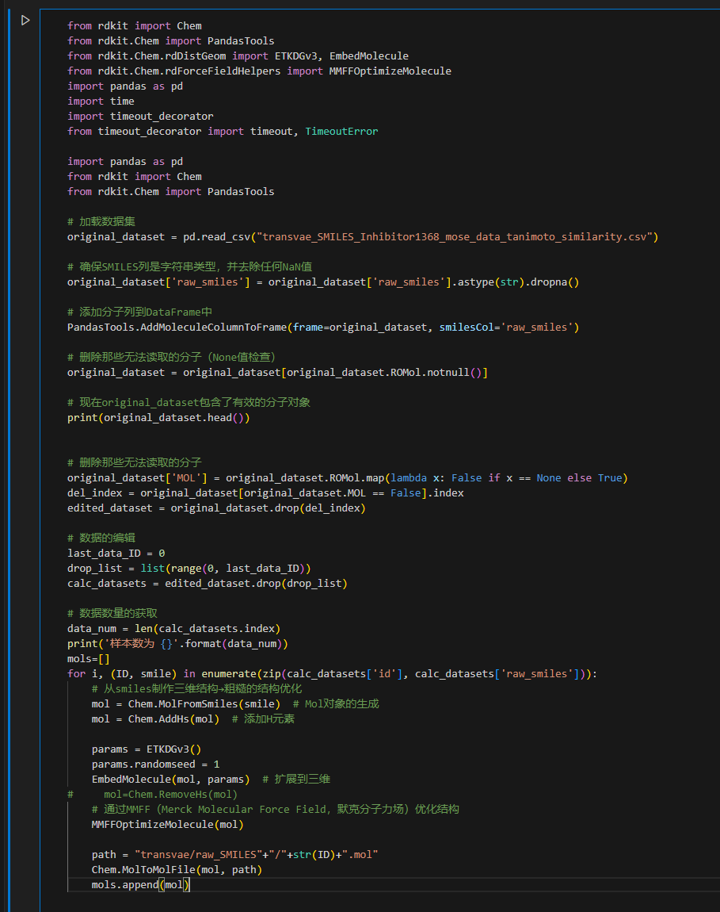
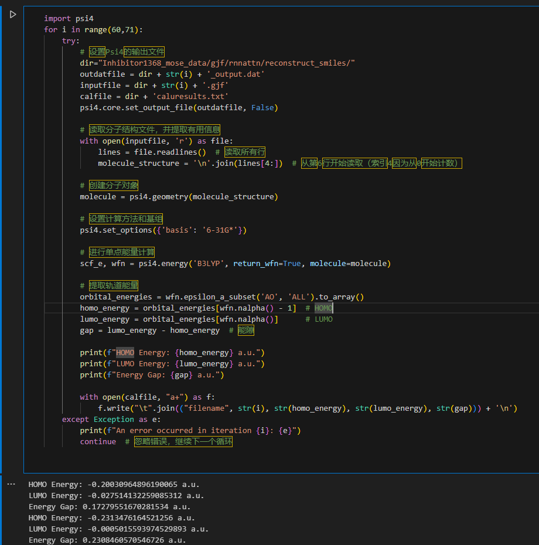
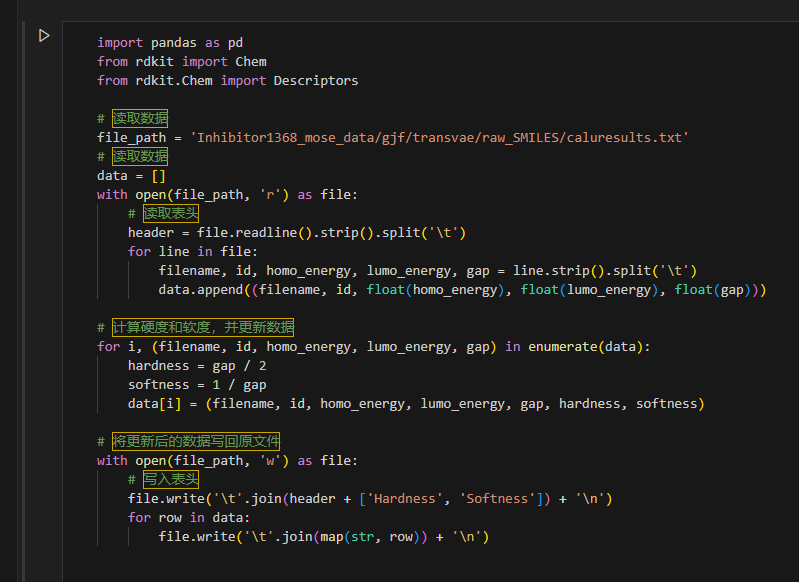

# Generating Corrosion Inhibitor Molecules using Variational Autoencoder Models

This repo contains the codebase for generating Corrosion Inhibitor Molecules using Variational Autoencoder Models. The code is organized by folders that correspond to the following sections:

- **transvae**: code required to run models including model class definitions, data preparation, optimizers, etc.
- **scripts**: scripts for training models, generating samples and performing calculations
- **checkpoints**: pre-trained model files
- **Inhibitor1368_data**: all data including SMIELS files, propotion files, token vocabularies and weights for Inhibitor1368_data.
- **Inhibitor1368_mose_data**:all data including SMIELS files, propotion files, token vocabularies and weights for Inhibitor1368-mose-9.
- **figures**: all figures generated in the project.
- **trials**: all loss files in the model training.

## Installation

[RDKit](https://www.rdkit.org/docs/Install.html) is required for certain visualizations/property calculations and must also be installed (neither of these packages are necessary for training or generating molecules so if you would prefer not to install them then you can simply remove their imports from the source code).

## Before training
run all codes of 0-preprocessData.ipynb to generate the training datasets including the following files:




## Training
usage: train.py [-h]

                 --model {transvae,rnnattn,rnn} [--d_model D_MODEL] [--d_feedforward D_FEEDFORWARD]

                [--d_latent D_LATENT] [--property_predictor] [--d_property_predictor D_PROPERTY_PREDICTOR]

                [--depth_property_predictor DEPTH_PROPERTY_PREDICTOR] [--batch_size BATCH_SIZE]

                [--batch_chunks BATCH_CHUNKS] [--beta BETA] [--beta_init BETA_INIT]

                [--anneal_start ANNEAL_START] [--adam_lr ADAM_LR] [--lr_scale LR_SCALE]

                [--warmup_steps WARMUP_STEPS] [--eps_scale EPS_SCALE] [--epochs EPOCHS] --data_source

                {zinc,pubchem,custom} [--train_mols_path TRAIN_MOLS_PATH] [--test_mols_path TEST_MOLS_PATH]

                [--train_props_path TRAIN_PROPS_PATH] [--test_props_path TEST_PROPS_PATH]

                [--vocab_path VOCAB_PATH] [--char_weights_path CHAR_WEIGHTS_PATH] [--checkpoint CHECKPOINT]

                [--save_name SAVE_NAME] [--save_freq SAVE_FREQ]


There are three model types - RNN (a), RNNAttn (b) and Transformer (c). 
If you want to train using SMILES and propotion files, you need to set --property_predictor, for example:

`python train.py --model transvae --data_source custom --train_mols_path Inhibitor1368_mose_data/train_mols.txt --test_mols_path Inhibitor1368_mose_data/test_mols.txt --property_predictor --train_props_path Inhibitor1368_mose_data/train_props.txt --test_props_path Inhibitor1368_mose_data/test_props.txt  --epochs 50 --vocab_path Inhibitor1368_mose_data/Inhibitor1368_mose_data_char_dict.pkl --char_weights_path Inhibitor1368_mose_data/char_weights_Inhibitor1368_mose_data.npy --save_name Inhibitor1368_mose_model`

If you want to train using transvae model, you need to modify the following code of ransvae/trans_models.py, for example, the number of propotion is 9, then the self.src_len = 134, self.tgt_len = 133



 ## Generate new Corrosion Inhibitor Molecules

 run the code of 0-preprocessData.ipynb as following.


## calculate_HOMO-LUMO
(1) The SMILES hydrogenated into rough 3D molecular structure by RDKit, performed a rough structure optimization based on MMFF, and saved the molecular structure in.mol file.
run the following code of 1-calculate_HOMO-LUMO.ipynb:


(2) Then Multiwfn software is used to batch change the.mol format file into the.gJf format file input by Gaussian. The gjf file contains the molecular structure information and keywords that Gaussian can recognize;

you need to download the Multiwfn_3.8_dev_bin_Linux_noGUI software:

```
#Convert geometry (final, input orientation) in all Gaussian .out files in current folder to .gjf file by Multiwfn
#!/bin/bash

icc=0
nfile=`ls /data1/ghy_data/Multiwfn_3.8_dev_bin_Linux_noGUI/Inhibitor1368_data_9/mol/transvae/reconstruct_smiles/*.mol|wc -l`
for inf in /data1/ghy_data/Multiwfn_3.8_dev_bin_Linux_noGUI/Inhibitor1368_data_9/mol/transvae/reconstruct_smiles/*.mol
do
((icc++))
echo Converting ${inf} to ${inf//out/gjf} ... \($icc of $nfile\)
Multiwfn_noGUI ${inf} << EOF > /dev/null
100
2
10
${inf//out/gjf}
0
q
EOF
done
```

```
#!/bin/bash
folder_path="/data1/ghy_data/Multiwfn_3.8_dev_bin_Linux_noGUI/Inhibitor1368_data_9/mol/transvae/raw_smiles"
if [ ! -d "$folder_path" ]; then
    echo "文件夹不存在：$folder_path"
    exit 1
fi

cd "$folder_path"

for file in *.mol; do
    if [ -e "$file" ]; then
        mv "$file" "${file%.mol}.gjf"
        echo "已将 $file 改名为 ${file%.mol}.gjf"
    fi
done

echo "处理完成！"

```

(3) Finally, the HOMO-LUMO band gap (i.e., molecular hardness) was calculated in batches using Gaussian from the converted gjf file.

you can run the following code of 1-calculate_HOMO-LUMO.ipynb:





Then, you will obtain the caluresults.txt file including the id, homo_energy, lumo_energy, gap,Hardness, Softness.

## Ploting
run the codes of 2-plot-metrics.ipynb to plot figures in this project.